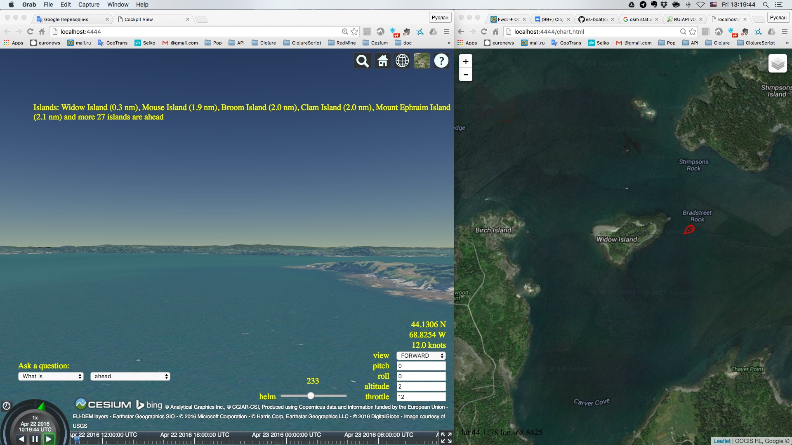

# es-boat

A prototype of an expert system for coastal navigation - the test example for the [rete4frames] (http://github.com/rururu/rete4frames) expert system shell.

It uses [Protege-3.5 ontology editor] (http://protege.stanford.edu/) as a knowledge representation system and GUI, [OpenStreetMap] (https://wiki.openstreetmap.org/wiki/API) API, [Leaflet] (http://leafletjs.com) JavaScript library, [Cesium] (https://cesiumjs.org/) WebGL virtual globe and map engine, [GeoNames] (http://www.geonames.org/) geographical database and Wikipedia.



## Start

```
$ cd <..>/es-boat/pro-server
$ lein run
```
## Usage

In the Protege window, run the menu item: Edit -> ClojureWork.

This starts a script that loads needed programs, starts expert system and opens browser window with a HUD and the controls of a boat. If you see black starry sky under blue sky, select in the "Imagery" menu in the right upper corner the item "ESRI World Imagery".

Set a throttle to some reasonable boat speed value in nautical miles. Contol course of the boat with a helm. The helm has 5 positions, from left to right: "hard a port", "port", "midship", "starboard", "hard a starboard". Preferred browser is Google Chrome.

You can open a nautical chart in another browser window on the address http://localhost:4444/chart.html.

To change a region of sailing in Protege GUI go to "Instances" tab, in "CLASS BROWSER" select a "StartPoint" class and create a new instance with a "shining diamond" button. Fill the "title" and "coord" fields with corresponding information and "glue yellow sticker" to this new instance with a "shining heart" button. Attention! Don't forget to remove the yellow sticker from the any other instance of the StartPoint class, only one can have such sticker and just it will be used as the starting point when you save a project and restart system.

For now expert system answers questions about nearby islands and other geographical objects and shows them on the HUD. Also, it can tell you about interesting things around, using Wikipedia database through GeoNames web services. More features still to come. Stay tuned.

Warning: Don't click links in the messages on the HUD (three dots in parentheses) by the left mouse button lest not to break the HUD. Do this by right button and open links in other tabs or windows.

Honestly, this is not only the boat, but also a vehicle that can go upon the ground along the roads and off roads. More then this, it is a flying apparatus that can fly above the ground and the sea. Just set the desired altitude and speed. Top secret! This is also a spacecraft, just set the altitude more then 120000. Happy flying!

Copyright and license
----

Copyright © 2016 Ruslan Sorokin.
Licensed under the EPL (see the file epl.html).
[License of Protege-3.5] (https://github.com/rururu/es-boat/blob/master/LICENSE)

